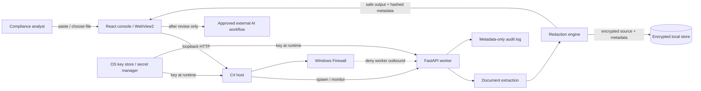

# Local-First PII Redaction Engine Threat Model

**Status:** Phase 1 baseline for the customer-pilot MVP  
**Version:** 0.1  
**Date:** 2026-09-24  
**Owner:** Product Security / Engineering  
**Classification:** Internal engineering and customer-assurance document

## 1. Purpose and security posture

This document defines the security model for a Windows local-first redaction product. The product processes documents and text containing PII, PHI, payment data, credentials, proprietary project names, and legal or engineering case information.

The product is a security-hardened local-first MVP, not a certification. It must not be marketed as HIPAA, GDPR, or CCPA certified. Certification and regulatory compliance depend on the customer's configuration, legal basis, policies, endpoint controls, and an independent assessment.

The primary security promise for the pilot is narrow:

> Source data is processed on the customer's machine, the worker listens on loopback, and only an explicitly reviewed redacted output may be copied to an external AI workflow.

The implementation must prove that promise with technical controls and deployment evidence. A UI message or application setting is not an egress control by itself.

## 2. Scope and assumptions

### In scope

- React/Vite local management console.
- C#/.NET host and lifecycle supervisor.
- FastAPI worker on `127.0.0.1`.
- Text and supported document extraction.
- Deterministic built-in rules and customer profiles.
- Encrypted local job storage.
- Manual review and safe-output export.
- Local configuration, logs, update, and installer paths.

### Out of scope for the current MVP

- Cloud processing by this product.
- Network proxy enforcement for every external application.
- Trained NER quality claims.
- Layout-preserving PDF/DOCX export.
- Enterprise identity integration.
- Windows AppContainer or a full parser sandbox.
- Independent penetration test, certification, or legal compliance opinion.

### Assumptions

- The endpoint is Windows 10/11 or a supported Windows Server release.
- The customer controls endpoint administration and firewall policy.
- The customer supplies or approves the key-management mechanism.
- An attacker with local administrator rights is outside the product-only threat boundary; the deployment must still minimize exposure and provide detection evidence.
- The customer does not treat the development fallback key file as production key management.

## 3. System context and data-flow diagram

### Data flows

| ID | Flow | Data | Protection requirement |
|---|---|---|---|
| F1 | Analyst to console | Raw pasted text or selected file | Never send to product cloud; UI must make local processing visible |
| F2 | Console to worker | Raw text/file over loopback | Bind to loopback, authenticate requests, size/time limits |
| F3 | Worker to parser | File bytes | Validate type/size, malware scan, parser isolation, no macros/external links |
| F4 | Parser to engine | Extracted text | Bounded memory/CPU, deterministic and timed rules |
| F5 | Engine to store | Source text, safe text, hashed entity metadata | Encrypt source at rest, retention policy, no plaintext logs |
| F6 | Engine to analyst | Safe output and review metadata | Do not return original entity values; approval gate before export |
| F7 | Analyst to external AI | Reviewed safe output | Explicit user action; host/firewall must prevent accidental raw-data egress |
| F8 | Worker/host to logs | Health, job ID, rule ID, timings, outcomes | No raw text, filenames may be sensitive and need configurable hashing |
| F9 | Host to key provider | Key retrieval/rotation request | DPAPI/Credential Manager/enterprise secret manager; never CLI or source control |

## 4. Trust boundaries

| Boundary | Separates | Threat | Required control |
|---|---|---|---|
| TB1 | Analyst/file system and console | Malicious or oversized input | UI validation, backend validation, quotas, malware scanning |
| TB2 | Console and worker | Local page/process impersonation | Per-installation local token, strict origin allowlist, loopback only |
| TB3 | Worker and parser libraries | Malformed PDF/DOCX/ZIP exploit | Pinned dependencies, parser timeout, low-privilege worker, sandbox/AppContainer |
| TB4 | Worker and encrypted store | Disk theft or offline database copy | OS-protected key, encrypted source, secure deletion, retention |
| TB5 | Worker and operating system | Process escape or file access | Dedicated low-privilege account, ACLs, sandbox, no outbound network |
| TB6 | Host and worker binary | Tampered executable or modules | Signed package, hash verification, controlled path, update verification |
| TB7 | Product and external AI provider | Raw PII egress | Review state, safe-output-only workflow, firewall/proxy enforcement |
| TB8 | Product and operators/admins | Unauthorized policy/key/audit actions | Authentication, authorization, audit trail, separation of duties |

## 5. Assets and data classification

| Asset | Classification | Owner | Required handling |
|---|---|---|---|
| Raw source text and uploaded files | Restricted / customer confidential | Customer | Process locally; encrypt at rest; minimize retention; never log |
| Safe redacted output | Confidential | Customer | Export only after review; preserve policy/job provenance |
| Encryption key | Secret / highest sensitivity | Customer security admin | OS key store or enterprise secret manager; rotation and recovery procedure |
| Profile definitions and custom rules | Confidential | Customer policy admin | Version, approve, validate, export/import safely |
| Entity hashes and offsets | Sensitive metadata | Customer | Avoid using as identity; protect logs and audit store |
| Audit events | Confidential | Customer security/compliance | Tamper-evident, metadata-only, retention-controlled |
| Worker/installer binaries | Integrity-sensitive | Product security | Sign, hash, SBOM, vulnerability scan, verified update path |
| Crash dumps and pagefile | Potentially Restricted | Customer endpoint admin | Disable/restrict collection according to endpoint policy |

## 6. STRIDE threat model

Risk levels: **Critical**, **High**, **Medium**, **Low**. Residual risk is the expected level after the required control is implemented.

| ID | STRIDE | Abuse case | Component/flow | Impact | Required mitigation | Residual target |
|---|---|---|---|---|---|---|
| S-01 | Spoofing | Another local process calls the worker API | TB2 / F2 | Raw input injection, unauthorized jobs | Per-installation bearer token from OS key store, strict loopback and origin checks | Medium |
| S-02 | Spoofing | Replaced Python/worker executable is launched | TB6 | Code execution with worker identity | Signed package, configured executable path, SHA-256 verification, update verification | Low |
| S-03 | Tampering | Attacker edits profiles or policy files | TB8 | PII bypass or over-redaction | Authenticated admin action, schema validation, profile version/hash, audit event | Medium |
| S-04 | Repudiation | Operator denies approving an export | F6/F7 | No defensible audit trail | Tamper-evident audit chain with actor, job, profile version, decisions, timestamp | Medium |
| S-05 | Information disclosure | Database theft exposes source text | TB4 | PII/PHI/company secret disclosure | Fernet/OS-managed key, production key required, secure deletion, retention | Medium |
| S-06 | Information disclosure | Logs, exception, crash dump, or pagefile contains raw text | F8 / OS | PII disclosure | Metadata-only logging, exception scrubbing, crash/pagefile policy, test log output | Medium |
| S-07 | Information disclosure | Key appears in environment/process inspection | F9 | Decrypts all local history | Prefer DPAPI/Credential Manager handle; avoid CLI/env in production; rotate | Medium |
| S-08 | Denial of service | Catastrophic regex or huge document consumes CPU/RAM | TB1/TB3/F4 | Worker unavailable | `regex` timeout, size limits, parser timeout, quotas, watchdog, queue isolation | Medium |
| S-09 | Denial of service | Malformed archive/PDF exploits parser or decompression bomb | TB3 | Worker crash or code execution | Malware scan, parser updates, archive limits, sandbox, no macro/link execution | High until sandboxed |
| S-10 | Elevation of privilege | Parser exploit reaches host account | TB3/TB5 | Local system compromise | Dedicated low-privilege account, AppContainer/job object, deny write/read ACLs | High until sandboxed |
| S-11 | Tampering | Raw output is exported before review | F6/F7 | PII sent to external provider | Server-side status gate, approved-only download, firewall egress deny | Medium |
| S-12 | Information disclosure | Filename or custom rule reveals sensitive project name | F8/F9 | Metadata disclosure | Hash/configure filenames in logs; treat profiles as confidential | Low |
| S-13 | Tampering | Entity decision index is changed between review and export | F6 | Wrong content approved | Store immutable entity IDs, optimistic version, export current reviewed snapshot | Medium |
| S-14 | Spoofing | A malicious local webpage uses permissive CORS/API | TB2 | Unauthorized processing | Local token, CSRF-resistant API, strict origins, no wildcard CORS | Medium |

High/critical risks must block a customer pilot until the mitigation is implemented and tested. In particular, parser sandboxing, local API authentication, egress enforcement, and production key storage are not optional claims.

## 7. Security requirements

### Identity, authorization, and API

- **SEC-API-001:** Every worker request except health checks requires a per-installation local token.
- **SEC-API-002:** Tokens are generated locally, stored using DPAPI/Credential Manager, rotated, and never logged.
- **SEC-API-003:** Admin endpoints for profiles, retention, key rotation, diagnostics, and audit export require an admin role.
- **SEC-API-004:** CORS remains an allowlist convenience only; it is not authentication.
- **SEC-API-005:** Requests have maximum body size, upload size, timeout, concurrency, and queue limits.
- **SEC-API-006:** Unknown fields and invalid profiles/rules are rejected; profile version is recorded with every job.

### Data protection and retention

- **SEC-DATA-001:** Production startup fails closed when no OS-managed encryption key is available.
- **SEC-DATA-002:** Key rotation re-encrypts all retained source data or blocks rotation with a recoverable migration state.
- **SEC-DATA-003:** Raw source retention is configurable, defaults to the shortest useful review window, and has an automatic purge job.
- **SEC-DATA-004:** Delete removes database rows, WAL content, temporary files, and exported staging files, subject to documented OS limitations.
- **SEC-DATA-005:** Logs, metrics, traces, exceptions, and crash reports contain no raw source or entity values.
- **SEC-DATA-006:** The UI clearly states when source text is retained and provides an operator/admin purge action.

### Files and processing

- **SEC-FILE-001:** Uploads are scanned before parsing and are processed under a dedicated low-privilege identity.
- **SEC-FILE-002:** PDF/DOCX/ZIP parsers have pinned versions, timeouts, decompression limits, and no macro/external-link execution.
- **SEC-FILE-003:** Parser output is bounded by character, page, table, archive, memory, and execution limits.
- **SEC-FILE-004:** Worker crashes are isolated from the desktop host and do not expose source text in diagnostics.
- **SEC-FILE-005:** Supported-format export is either layout-preserving or explicitly labeled as text-only.

### Detection and policy

- **SEC-RULE-001:** Built-in and custom rules use a common `RedactionEngine` interface.
- **SEC-RULE-002:** Custom regex is compiled and executed with safe syntax restrictions and a hard timeout.
- **SEC-RULE-003:** Profiles are versioned, validated, exportable, importable, and approved before use.
- **SEC-RULE-004:** A local NER model is versioned and evaluated with precision, recall, F1, false-positive, and false-negative metrics before release.
- **SEC-RULE-005:** Placeholder identity is stable within a document and entity resolution prevents one value being assigned conflicting placeholder types.
- **SEC-RULE-006:** Low-confidence and conflicting detections require human review; the system must fail closed for export.

### Egress and deployment

- **SEC-NET-001:** The worker binds only to loopback and has a Windows Firewall outbound-deny rule.
- **SEC-NET-002:** The product does not claim to intercept all external applications until a tested proxy/gateway is deployed.
- **SEC-DEP-001:** Installers and worker binaries are signed; updates are verified before execution.
- **SEC-DEP-002:** The host verifies the configured worker hash and refuses unexpected binaries.
- **SEC-DEP-003:** The worker runs under a dedicated low-privilege account or AppContainer with least-privilege ACLs.
- **SEC-DEP-004:** CI produces a pinned offline artifact, SBOM, dependency scan, signed installer, and reproducible release manifest.

## 8. Abuse cases and security tests

| Abuse case | Expected result | Test evidence |
|---|---|---|
| Upload a 1 GB file | Reject before parsing; worker remains healthy | Integration test and resource test |
| Upload a decompression bomb | Scan/reject or terminate isolated parser | Malware/parser test |
| Submit pathological custom regex | Reject unsafe syntax or timeout within budget | ReDoS fuzz test |
| Call API from unauthorized local process | 401/403; no job created | Auth integration test |
| Change profile file while processing | Use immutable validated version; record mismatch | Concurrency test |
| Kill worker during processing | Host detects, cleans child tree, no partial export | Host integration test |
| Read SQLite without key | Source remains unreadable | Encryption test |
| Rotate key during retained jobs | All retained rows re-encrypted or operation safely blocked | Key rotation test |
| Download before all decisions | 409/403; no output returned | API test |
| Export after rejecting a detection | Export reflects current reviewed state | End-to-end test |
| Put PII in custom rule name/filename | Reject or redact metadata; never log raw value | Log inspection test |
| Tamper with installer/worker | Signature/hash verification fails closed | Release test |

## 9. Retention and deletion policy baseline

The pilot default should be:

- Raw source: retain only while a job is `needs_review`, with an administrator-configurable maximum of 24 hours.
- Safe output: retain for the same period unless the operator explicitly exports it; do not silently create extra copies.
- Job metadata: retain 30 days by default, excluding raw values and with configurable deletion.
- Audit events: retain 90 days or the customer's policy, whichever is stricter for the pilot.
- Profiles and versions: retain while referenced by audit events; profile deletion must not erase historical provenance.
- Temporary files: delete after each job and purge on startup.
- Failed jobs: retain only metadata and failure category unless troubleshooting is explicitly enabled by an administrator.

Deletion must be observable through a metadata-only audit event. Secure deletion cannot guarantee removal from all OS pagefile, backup, snapshot, or SSD wear-leveling locations; the deployment policy must address those layers.

## 10. Key management lifecycle

1. Generate a random data-encryption key during installation or obtain one from the approved enterprise secret manager.
2. Protect it with Windows DPAPI/Credential Manager or a managed secret service; do not put it in source code, ordinary environment files, command-line arguments, or logs.
3. Load it only in the worker process when needed and do not expose it through health/debug endpoints.
4. Support staged rotation: create new key, re-encrypt retained rows in a transaction, verify counts/hashes, then retire the old key after the backup window.
5. Back up the key according to the customer's recovery policy. Without the key, encrypted retained source is intentionally unrecoverable.
6. On suspected compromise, revoke/rotate the key, stop the worker, preserve metadata-only evidence, purge retained data, and reinstall from a verified artifact.

## 11. Incident response baseline

### Detection

- Worker integrity mismatch, unexpected child process, outbound firewall violation, repeated parser failures, token-auth failures, or audit-chain mismatch creates a security alert.
- Diagnostics contain job ID, component, event type, release hash, and timestamp, never raw source.

### Containment

1. Stop the worker and disable its network rules if needed.
2. Isolate the endpoint according to customer IR policy.
3. Preserve signed logs, hashes, firewall state, and key-rotation metadata without copying raw documents.
4. Revoke/rotate local API and data keys.

### Eradication and recovery

1. Identify the affected release, dependency, parser, profile, or account.
2. Reinstall from a verified signed artifact.
3. Restore only encrypted data with a verified key, or purge it if exposure is suspected.
4. Re-run health, integrity, redaction, firewall, and audit-chain checks.
5. Notify the customer through the agreed incident contact and document scope, timeline, and corrective action.

## 12. UX requirements for non-technical analysts

- **UX-001 First run:** A wizard verifies worker health, key source, data directory ACL, firewall state, and a harmless test redaction before the first real file.
- **UX-002 Three steps:** `Paste or upload` -> `Review detections` -> `Download approved output`.
- **UX-003 Review clarity:** Show a visual diff with detection highlights, entity type, confidence, replacement, and reason; never show raw values in logs or unrelated history.
- **UX-004 Bulk review:** Approve all, reject all, filter by entity type/confidence, and undo/redo with a clear current status.
- **UX-005 Safe export:** Disable export until every detection is decided and show the active profile version.
- **UX-006 Recovery:** Show progress, cancellation, retry, parser-specific errors, and a worker restart path without losing completed metadata.
- **UX-007 Accessibility:** Keyboard navigation, visible focus, screen-reader labels, color-independent status, minimum contrast meeting WCAG 2.1 AA, and no critical action conveyed by color alone.
- **UX-008 Localization:** English and Russian strings are externalized; security-critical warnings are translated and reviewed.
- **UX-009 Offline:** The product remains usable without internet and clearly reports that no cloud call is required for redaction.
- **UX-010 Admin settings:** Retention, key rotation, profile versioning, audit export, diagnostics, and firewall state are separated from the analyst workflow.

## 13. Definition of security readiness

The MVP is ready for a controlled customer pilot only when all Critical/High findings in this document have an owner, mitigation, test evidence, and residual-risk acceptance. The release package must include:

- Threat model and architecture review.
- Signed installer and worker hash manifest.
- SBOM and dependency vulnerability report.
- Firewall configuration and verification output.
- Key-management and rotation runbook.
- Retention/deletion policy.
- Unit, integration, E2E, fuzz, parser, ReDoS, migration, and log-scrubbing test results.
- Penetration-test checklist and independent assessment plan.
- Known limitations and customer responsibilities.

No release may be described as certified or guaranteed secure based solely on this document.

## 14. Phase ownership map

| Phase | Primary files/components | Deliverable |
|---|---|---|
| Phase 1 | `docs/THREAT_MODEL.md`, `README.md` | Approved threat model and requirements baseline |
| Phase 2 | `backend/app/auth.py`, `audit.py`, `rate_limit.py`, `key_provider.py`, `extractors.py`, `storage.py`, `main.py` | Authenticated, bounded, auditable worker |
| Phase 3 | CI workflow, packaging scripts, installer, firewall scripts | Reproducible signed offline deployment |
| Phase 4 | `desktop/SecureRedactionHost/Program.cs` and installer integration | Verified worker, watchdog, firewall/key lifecycle |
| Phase 5 | `frontend/src/App.jsx`, `styles.css`, localization/settings modules | Onboarding and accessible analyst workflow |
| Phase 6 | backend/frontend/host test suites and CI | Security regression and release gates |
| Phase 7 | `README.md`, `docs/SECURITY_GUIDE.md`, `docs/DEPLOYMENT_GUIDE.md`, `docs/USER_GUIDE.md`, `docs/ADMIN_GUIDE.md` | Customer and auditor documentation |
